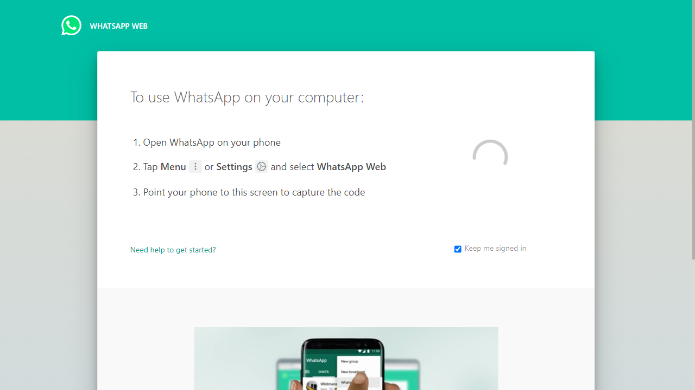
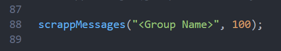
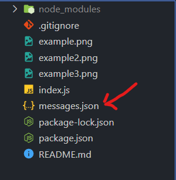

"# web_scrapper-web-Whatsapp"

This Script Scrappes the data from web-whatsapp with user permission.

1. Scan QR code for the Web-Whatsapp.
   
2. Enter the GroupName and NumberOfMessages in script itself.
   
3. run the script with Node.
   
4. output (JSON file)
   
